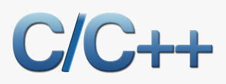

# Learn C & C++

## C++ 新经典

[学习视频列表-YouTube](https://www.youtube.com/playlist?list=PL6DEHvciXKeXyH1g8m5fvIEPYx4hANmaR)

## C++ Application Development with Code::Blocks

[Video List at YouTube](https://www.youtube.com/playlist?list=PL6DEHvciXKeXa4qf4zjDClFQ-J8GhKT9Y)

## 三维图形化C++趣味编程

[学习视频列表-YouTube](https://www.youtube.com/playlist?list=PL6DEHvciXKeWFRhA4aJkTkoov1foMv22D)

## 啊哈C语言 (aha C language)

- [学习视频列表-YouTube](https://www.youtube.com/playlist?list=PL6DEHvciXKeVzQIMSwYjtMO3v8HmU9OOZ)
- [发布在Udemy上的课程](https://www.udemy.com/course/learn-c-programming-by-practicing/?referralCode=3E4C8AD906D7949D4244)
- [Repository on Github](https://github.com/yasenstar/aha-C)

---

Thanks for your support.