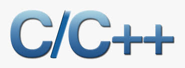
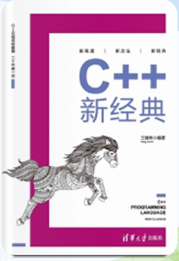

# Learn C++ (and C) with Practice

## C++ 新经典, language: 中文 Chinese

|book|content structure|
| --- | --- |
|  | 

学习源代码和相关参考内容：[学习笔记](cpp_new/README.md)

- [学习视频列表-YouTube](https://www.youtube.com/playlist?list=PL6DEHvciXKeXyH1g8m5fvIEPYx4hANmaR)
- [视频列表-B站 bilibili](https://space.bilibili.com/158390142/lists/2469667?type=season)
- [视频列表 - 抖音](https://www.douyin.com/collection/7583734438882707496/1?previous_page=general_search)

## C++ Application Development with Code::Blocks, language: English

[Video List at YouTube](https://www.youtube.com/playlist?list=PL6DEHvciXKeXa4qf4zjDClFQ-J8GhKT9Y)

## 三维图形化C++趣味编程, language: Chinese

[学习视频列表-YouTube](https://www.youtube.com/playlist?list=PL6DEHvciXKeWFRhA4aJkTkoov1foMv22D)

## 啊哈C语言 (aha C language), language: Chinese

- [学习视频列表-YouTube](https://www.youtube.com/playlist?list=PL6DEHvciXKeVzQIMSwYjtMO3v8HmU9OOZ)
- [发布在Udemy上的课程 / Course in Udemy](https://www.udemy.com/course/learn-c-programming-by-practicing/?referralCode=3E4C8AD906D7949D4244)
- [Repository on Github](https://github.com/yasenstar/aha-C)

---

# C++ Programming Tools and Documentations

Great thanks [Rick Halterman @ cs.southern.edu](https://www.cs.southern.edu/halterman/Tools/index.html) for sharing the information.

- Microsoft provides a series of short tutorials on using Visual Studio for C++ development:
    1. [Install C++ support in Visual Studio](https://docs.microsoft.com/en-us/cpp/build/vscpp-step-0-installation)
    2. [Create a C++ console app project](https://docs.microsoft.com/en-us/cpp/build/vscpp-step-1-create)
    3. [Build and run a C++ console app project](https://docs.microsoft.com/en-us/cpp/build/vscpp-step-2-build)

- [ISO C++](http://isocpp.org/) is the official home of standard C++

- C++ References
    - [C++ Reference](http://www.cppreference.com/) documents the C++ Standard Library
    - [The C++ Resources Network](http://www.cplusplus.com/) includes general information about C++, an FAQ, a C++ language tutorial, library documentation, and forums
    - [Bjarne Stroustrup's C++ Page](http://www.research.att.com/~bs/C++.html) provides just about everything you need to know about C++ style, techniques, philosophy, and history from the creator of C++ himself
    - [Fred's C++ Notes](http://www.fredosaurus.com/notes-cpp/) includes sample C++ code for for common programming problems, exercises, and miscellaneous C++ tips
    - [Marshall Clines's C++ FAQ Lite](http://www.parashift.com/c++-faq-lite/) includes general information about C++, an FAQ, a C++ language tutorial, library documentation (including the STL), and forums
    - [Porter Scobey's 's C++ Reference](http://cs.stmarys.ca/~porter/csc/ref/index_cpp.html) includes general information about C++ and good STL and general C library references
    - [The C++ Not So Frequently Asked Questions](http://notfaq.wordpress.com/category/cc/) site provides a few somewhat obscure but very useful C++ tips and tricks

- [Visual Studio Keyboard Shortcuts](http://www.dofactory.com/ShortCutKeys/ShortCutKeys.aspx)

- GNU C++
    - [MinGW](http://www.mingw.org/) includes a free GNU C++ compiler and associated tools for Windows
    - [Xcode](http://developer.apple.com/tools/xcode/) provides a C++ development IDE for OS X
    The GNU C++ developer tools are available as installable packages on all the common Linux distributions.

- The [Eclipse project](http://www.eclipse.org/downloads/index.php) has a free integrated development environment for C++. Versions are available for Windows, OS X, and Linux. It requires Java.

---

Thanks for your support.