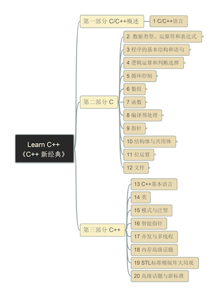

# C++ 新经典

- [C++ 新经典](#c-新经典)
  - [思维导图](#思维导图)
  - [内容](#内容)
  - [演示视频](#演示视频)

## 思维导图

Please install FreePlane to open the mindmap file.

## 内容

- [第一部分：概览](Part1-Overview)
- [第二部分：C语言](Part2-lang_c)
- [第三部分：C++语言](Part3-lang_cpp)

## 演示视频

- [学习视频列表-YouTube](https://www.youtube.com/playlist?list=PL6DEHvciXKeXyH1g8m5fvIEPYx4hANmaR)
- [视频列表-B站 bilibili](https://space.bilibili.com/158390142/lists/2469667?type=season)
- [视频列表 - 抖音](https://www.douyin.com/collection/7583734438882707496/1?previous_page=general_search)

---

更新日期：12/19/2025, 10:49:20 AM