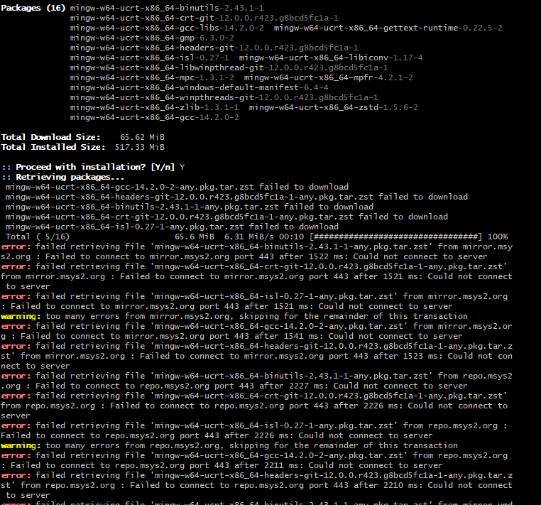

# How to Install C/C++ Compiler Behind Firewall

## Background of Problem

For building and compiling C/C++ program, the easier way is to install Microsoft Visual Studio (now version is 2022), from which you may choose "Desktop C/C++ Development" then you have compiler installed.

However, developing in MS VS requires you create one project every time and that makes the work too heavy to cope with, so it would be lighter to setup C/C++ development environment in VS Code.

Microsoft provides nice [documentation and guide](https://code.visualstudio.com/docs/languages/cpp) that you can follow to make C/C++ readiness for Visual Studio Code.

For Windows OS, two compilers - MSVC or MinGW - can be chosen.

I tried MinGW (https://www.msys2.org/), the guide is good and clear, but since my computer is behind company's firewall, when running `pacman` command below:

```
$ pacman -S mingw-w64-ucrt-x86_64-gcc
```

I got below errors that "failed retrieving file", part of the error message like:

```
...
Total Download Size:    65.62 MiB
Total Installed Size:   517.33 MiB

:: Proceed with installation? [Y/n] Y
:: Retrieving packages...
 mingw-w64-ucrt-x86_64-gcc-14.2.0-2-any-pck.tar.zst failed to downlod
...
error: failed retrieving file 'mingw-w65-ucrt-x86_64-binutils-2.43.1-1-any.pkg.tar.zst' from mirror.msys2.org : Failed to connect to mirror.msys2.org port 443 after 1522 ms: Could not connect to server
...
```



Checked with support team, it is the firewall policy that blocks this traffic, thus I need to find the way to install C/C++ compiler without direct connecting the traffic via firewall.

## Method 1: Open Firewall Port

This is the direct approach, once the firewall policy doesn't block this traffic, you can follow the Microsoft standard guide to finish the setup.

Have raised the request, and need to wait on the firewall / network team's review on this demand, so you're depending on the company's policy.

## Method 2: Use `MinGW-MSYS Bundle`

Come to here https://sourceforge.net/projects/mingwbundle/.

MinGW-MSYS Bundle is an unified single installer, which deploys both MinGW and MSYS at the same time.

It does not require Internet connection and installs the latest core components and libraries.

From the description, it can fulfill my needs, so I downloaded this open-source package (~334MB for Windows). While during the installing, it pop up saying you need to send a mail to "info@matear.eu" to get one Registration Code.

So, the installation is paused, I've sent the mail and waiting for the response.

## Method 3: Use `TDM-GCC Bundle`

Credit to [Alexander McFarlane](https://superuser.com/users/612821/alexander-mcfarlane)'s post at https://superuser.com/questions/713582/mingw-installer-not-working-with-proxy, which mentions this `TDM-GCC`.

Steps as below:

1. Go to http://jmeubank.github.io/tdm-gcc/download/
2. Download the bundle installer that is correct for your system, to my Windows 11, I choose `tdm64-gcc-10.3.0-2.exe` (~78.6MB)
3. Run installer, which doesn't have depedency on firewall

It is installed in `C:\TDM-GCC-64` folder, and you can check compiler version in a terminal as below:

```BASH
Microsoft Windows [Version 10.0.22631.4751]
(c) Microsoft Corporation. All rights reserved.

C:\>gcc --version
gcc (tdm64-1) 10.3.0
Copyright (c) 2020 Free Software Foundation, Inc.
```

This means your compiler is installed correctly.

## Configuratoin in VS Code to Use TDM-GCC

At your VS Code repository folder, there will be one hidden sub-folder called `.vscode`, three files inside `launch.json`, `settings.json` and `tasks.json`.

Open and edit the `tasks.json` file with correct TDM-GCC-64 BIN path, as below:

```JSON
{
    "tasks": [
        {
            "type": "cppbuild",
            "label": "C/C++: g++.exe build active file",
            "command": "C:\\TDM-GCC-64\\bin\\g++.exe",
            "args": [
                "-fdiagnostics-color=always",
                "-g",
                "${file}",
                "-o",
                "${fileDirname}\\${fileBasenameNoExtension}.exe"
            ],
            "options": {
                "cwd": "C:\\TDM-GCC-64\\bin"
            },
            "problemMatcher": [
                "$gcc"
            ],
            "group": {
                "kind": "build",
                "isDefault": true
            },
            "detail": "Task generated by Debugger."
        }
    ],
    "version": "2.0.0"
}
```

After this, you can choose `Run C/C++ file` from run button to trigger compiling and building, the EXE file will be created and program will be run.

---

Date: 2025/02/10