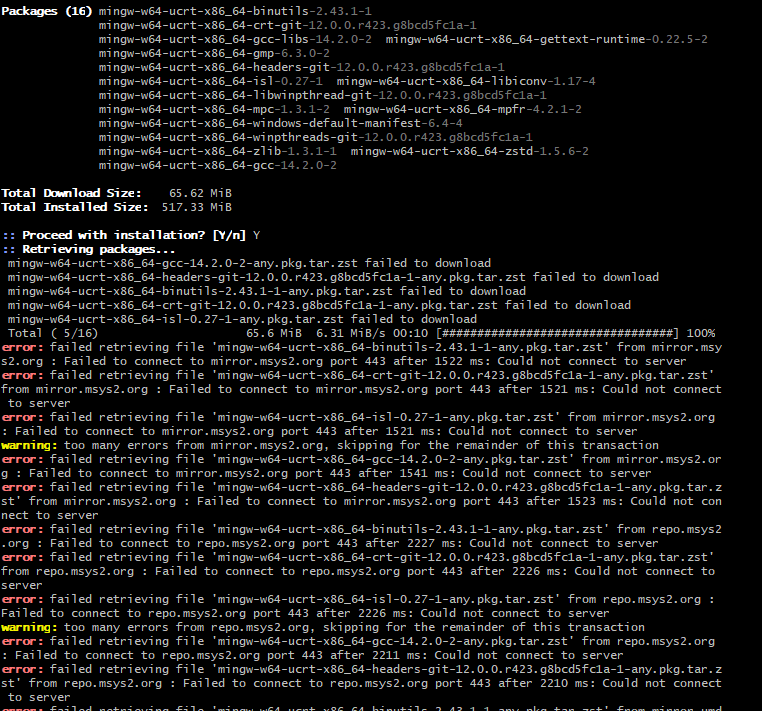

# 防火墙后面，如何在VSCODE中安装配置C/C++编译环境

## B问题背景


对于构建和编译 C/C++ 程序，更简单的⽅法是安装 Microsoft Visual Studio（现在的版本是 2022），您可以从中选择“桌⾯ C/C++ 开发”，那么你已经安装了编译器。

然⽽，在 MS VS 中开发需要你每次创建⼀个项⽬，这使得⼯作量太⼤，难以应付，所以设置 C/C++ 开发会更轻松 VS Code 中的环境。

微软提供了很好的[⽂档和指南](https://code.visualstudio.com/docs/languages/cpp)你可以按照它来制作 C/C++为 Visual Studio Code 做好准备。

对于 Windows 操作系统，可以选择两个编译器 - MSVC 或 MinGW。

我尝试了 MinGW (https://www.msys2.org/)，指南很好，很清晰，但由于我的电脑落后于公司的
防⽕墙，运⾏下⾯的pacman命令时：

```
$ pacman -S mingw-w64-ucrt-x86_64-gcc
```

我收到以下错误“⽆法检索⽂件”，部分错误消息如下：

```
...
Total Download Size:    65.62 MiB
Total Installed Size:   517.33 MiB

:: Proceed with installation? [Y/n] Y
:: Retrieving packages...
 mingw-w64-ucrt-x86_64-gcc-14.2.0-2-any-pck.tar.zst failed to downlod
...
error: failed retrieving file 'mingw-w65-ucrt-x86_64-binutils-2.43.1-1-any.pkg.tar.zst' from mirror.msys2.org : Failed to connect to mirror.msys2.org port 443 after 1522 ms: Could not connect to server
...
```



与⽀持团队核实后，发现是防⽕墙策略阻⽌了该流量，因此我需要找到安装 C/C++ 编译器的⽅法，⽽⽆需通过防⽕墙直接连接流量。

## ⽅法 1：打开防⽕墙端⼝

这是直接的⽅法，⼀旦防⽕墙策略不阻⽌此流量，您可以按照 Microsoft 标准指南完成设置。

已经提出请求，需要等待防⽕墙/⽹络团队对此需求的审核，因此你依赖于公司的政策。

## ⽅法 2：使⽤ `MinGW-MSYS` 软件包

请访问此处 https://sourceforge.net/projects/mingwbundle/.

MinGW-MSYS Bundle 是⼀个统⼀的单⼀安装程序，可以同时部署 MinGW 和 MSYS。它不需要互联⽹连接并安装最新的核⼼组件和库。

从描述来看，它可以满⾜我的需求，所以我下载了这个开源软件包（Windows 版约 334MB）。在安装过程中，系统弹出提⽰，要求发送邮件⾄“info@matear.eu”获取⼀个注册码。

因此，安装暂停，我已发送邮件并等待回复。

## ⽅法 3：使⽤ `TDM-GCC` 软件包

感谢 [Alexander McFarlane](https://superuser.com/users/612821/alexander-mcfarlane) 发表于 https://superuser.com/questions/713582/mingw-installer-not-working-with-proxy 的建议，提到这个 `TDM-GCC`.

步骤如下：

1. 前往 http://jmeubank.github.io/tdm-gcc/download/
2. 下载适合你的操作系统的软件包安装程序，我使用的是 Windows 11,，所以选择了 `tdm64-gcc-10.3.0-2.exe` (~78.6MB)
3. 运⾏这个不依赖防⽕墙的安装程序

它安装在C:\TDM-GCC-64⽂件夹中，您可以在终端中检查编译器版本，如下所⽰：

```BASH
Microsoft Windows [Version 10.0.22631.4751]
(c) Microsoft Corporation. All rights reserved.

C:\>gcc --version
gcc (tdm64-1) 10.3.0
Copyright (c) 2020 Free Software Foundation, Inc.
```

这意味着您的编译器已正确安装。

## 在 VS Code 中配置以使⽤ TDM-GCC

在你的 VS Code 存储库⽂件夹中，将有⼀个名为.vscode的隐藏⼦⽂件夹，其中包含`launch.json` 、 `settings.json`和`task.json`三个⽂件。

打开并使⽤正确的 TDM-GCC-64 BIN 路径编辑jobs.json⽂件，如下所⽰：

```JSON
{
    "tasks": [
        {
            "type": "cppbuild",
            "label": "C/C++: g++.exe build active file",
            "command": "C:\\TDM-GCC-64\\bin\\g++.exe",
            "args": [
                "-fdiagnostics-color=always",
                "-g",
                "${file}",
                "-o",
                "${fileDirname}\\${fileBasenameNoExtension}.exe"
            ],
            "options": {
                "cwd": "C:\\TDM-GCC-64\\bin"
            },
            "problemMatcher": [
                "$gcc"
            ],
            "group": {
                "kind": "build",
                "isDefault": true
            },
            "detail": "Task generated by Debugger."
        }
    ],
    "version": "2.0.0"
}
```

现在，您可以从运⾏按钮中选择运⾏ C/C++ ⽂件来触发编译和构建，将创建 EXE 文件。

---

日期: 2025/02/10